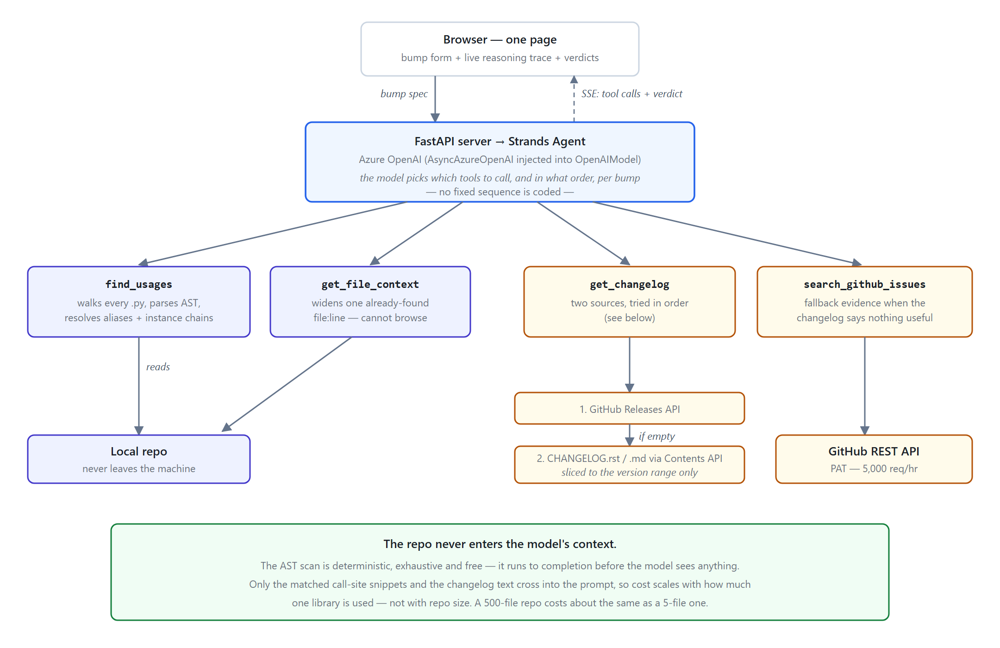

# driftwatch

**Dependabot tells you a version changed. This tells you whether it touches *your* code.**

Dependabot and Renovate open PRs saying "bump urllib3 1.26.15 → 2.2.1". They compare version
numbers and CVE databases. They never read your code. So you either merge blind or let the PR
rot for months.

`driftwatch` reads how your codebase *actually uses* the library, then reports per call site
whether this specific bump touches it — grounded in the library's real changelog, not the
model's memory.

Built with the [Strands Agents SDK](https://strandsagents.com) for the AWS *Agents for Humans*
hackathon.

---

## What it actually produces

For `cryptography 42.0.0 → 46.0.3` against a codebase using both Blowfish and AES:

| Line | Code | Verdict |
|---|---|---|
| 24 | `cipher = Cipher(algorithms.Blowfish(key), modes.CBC(iv))` | **AFFECTED** — changelog for 46.0.0 states `Blowfish` was removed from the cipher module |
| 30 | `cipher = Cipher(algorithms.AES(key), modes.CBC(iv))` | **NOT AFFECTED** — `AES` is untouched by this change |

Same file, same library, same bump — different answers per call site. That's the whole point.

It is deliberately **not** a binary safe/unsafe verdict. Changelogs are frequently vague, and
"removed" in a changelog often means "the documented home moved" rather than "your code will
crash." The agent is instructed to distinguish those and to say `UNCLEAR` when the evidence
genuinely doesn't support a call.

---

## Architecture



### The key design decision

**The repo never enters the model's context.** Finding call sites is a solved, deterministic
problem — Python's built-in `ast` module does it exhaustively and for free. That scan runs to
completion *before* the model is involved. Only the matched call-site snippets and the changelog
text are sent to the LLM.

The consequence: cost scales with **how much one library is used**, not with repo size. A
500-file repo where `urllib3` appears in 6 places costs about the same as a 5-file one.

### Why it's an agent, not a pipeline

No tool sequence is hardcoded. The model is given four tools and decides which to call, in what
order, and when it has enough evidence to stop. Observed behaviour across the three demo
scenarios:

| Scenario | Tools called | Why |
|---|---|---|
| `requests 2.30.0 → 2.31.0` | `find_usages`, `get_changelog` | Changelog was specific; it stopped rather than padding the trace |
| `urllib3 1.26.15 → 2.2.1` | + `get_file_context` | Two call sites were ambiguous from the snippet alone |
| `cryptography 42.0.0 → 46.0.3` | + `search_github_issues` | Repo publishes **zero** GitHub Releases, so it had to look elsewhere |

The live reasoning trace in the UI shows this happening in real time.

### The four tools

| Tool | What it does | Touches |
|---|---|---|
| `find_usages` | Two-pass AST scan of every `.py` file. Resolves import aliases (`import requests as req`), instance chains (`http = urllib3.PoolManager()` → `http.request()` → `resp.getheader()`), and **shared clients imported from other modules** (`from clients import http`) — so usage is caught even when the line never names the library. | Local disk |
| `get_changelog` | Real release notes for the version range, paginated. Tries the GitHub Releases API, then falls back to the repo's own `CHANGELOG.rst`/`.md` — necessary because publishing Releases is optional and some major projects never do. | GitHub API |
| `get_file_context` | Widens the view around one already-identified `file:line`. Cannot browse — it only sees locations `find_usages` already returned. | Local disk |
| `search_github_issues` | Searches the library's issues/PRs when the changelog is vague or absent. | GitHub API |
| `list_dependencies` | Reads `requirements.txt` / `pyproject.toml` and checks PyPI for newer versions — answers "what could move" before you audit anything. Drives the **Scan repo** button. | Local disk + PyPI |
| `post_verdict` | Formats the audit as a PR comment. Dry-runs by default; posting needs a write-scoped token. | GitHub API |

Any library resolves automatically via PyPI — no configuration needed. Verified on `fastapi`,
`pandas`, `boto3`, `sqlalchemy`, `httpx`, `sklearn`, and others.

**Performance:** measured over a 4,212-file corpus — 12.1s for `urllib3` (116 call sites across
15 files), 3.8s for `requests`. The scan is the cheap part; only the matched snippets reach the model.

---

## Setup

### Prerequisites

- **Python 3.10+** (developed on 3.14)
- **An Azure OpenAI deployment** of a tool-calling-capable model (GPT-4o, GPT-4o-mini, GPT-4,
  or GPT-3.5-turbo). Strands is model-agnostic — see [Using OpenAI or Bedrock
  instead](#using-openai-or-bedrock-instead) if you'd rather not use Azure.
- **A GitHub personal access token.** Not optional: unauthenticated GitHub API requests are
  capped at 60/hour *shared per IP address*, which is exhausted almost immediately. A token
  raises this to 5,000/hour.

### 1. Clone and create a virtual environment

```bash
git clone <your-repo-url>
cd driftwatch
python -m venv .venv
```

Activate it:

```bash
# macOS / Linux
source .venv/bin/activate

# Windows (PowerShell)
.venv\Scripts\Activate.ps1

# Windows (Git Bash)
source .venv/Scripts/activate
```

### 2. Install dependencies

```bash
pip install -r requirements.txt
```

### 3. Get your credentials

**GitHub token** (~30 seconds):
1. Go to <https://github.com/settings/tokens>
2. *Generate new token* → *Generate new token (classic)*
3. Give it any name and expiry. **No scopes are required** — everything this tool reads is
   public. Leave every checkbox unticked.
4. Copy the token (starts with `ghp_`). You won't be able to see it again.

**Azure OpenAI credentials:**
1. In the [Azure Portal](https://portal.azure.com), open your Azure OpenAI resource.
2. **Endpoint + API key**: under *Resource Management → Keys and Endpoint*. Copy the endpoint
   (looks like `https://your-resource.openai.azure.com/`) and either key.
3. **Deployment name**: under *Resource Management → Model deployments* (or in
   [Azure AI Studio](https://ai.azure.com) → *Deployments*). This is the name **you chose** when
   deploying the model — it is *not* the model name. If you deployed `gpt-4o-mini` and named the
   deployment `my-gpt4o-mini`, the value here is `my-gpt4o-mini`.
4. **API version**: `2024-08-01-preview` works. Any version supporting tool calling is fine.

### 4. Configure `.env`

```bash
cp .env.example .env
```

Then fill it in:

```ini
AZURE_OPENAI_API_KEY=your-key-here
AZURE_OPENAI_BASE_URL=https://your-resource.openai.azure.com/
AZURE_DEPLOYMENT_NAME=your-deployment-name
AZURE_API_VERSION=2024-08-01-preview

GITHUB_TOKEN=ghp_your_token_here
```

`.env` is gitignored. Never commit it.

### 5. Run it

```bash
uvicorn server:app --port 8000
```

Open <http://127.0.0.1:8000>. Three preset scenario buttons are wired up — click one, then
**Audit bump**, and watch the reasoning trace populate as the agent chooses its tools.

### Verifying the setup

```bash
python -m tests.test_tools
```

This exercises each tool against real data and degrades gracefully: the AST tools run with no
credentials at all, the GitHub tools run if `GITHUB_TOKEN` is set, and the full agent loop runs
if the Azure variables are also set. Each skipped section says why.

### Auditing your own code

The three preset buttons point at `fixtures/demo_repo`. To audit a real project, put its path in
**Repo path** and fill in the library and both versions manually.

⚠️ **The library must be one of the eight in the built-in mapping** (`urllib3`, `requests`,
`click`, `flask`, `pydantic`, `numpy`, `django`, `cryptography`) — otherwise supply the
**GitHub repo** field yourself as `owner/name`. Automatic PyPI → GitHub resolution is the
top item on the [roadmap](ROADMAP.md).

### Using OpenAI or Bedrock instead

Strands is provider-agnostic. Swap the model construction in `agent/agent.py`:

```python
# OpenAI
from strands.models.openai import OpenAIModel
model = OpenAIModel(client_args={"api_key": os.environ["OPENAI_API_KEY"]}, model_id="gpt-4o")

# Bedrock (Strands' default provider)
from strands.models import BedrockModel
model = BedrockModel(model_id="anthropic.claude-sonnet-4-20250514-v1:0")
```

Azure needs the `client=` injection currently in `agent.py` rather than `client_args` — Strands'
`OpenAIModel` builds a plain `openai.AsyncOpenAI` internally, which doesn't send the
`api-version` parameter Azure requires on every request.

---

## Known limitations

Stated plainly, because a tool that reports on correctness should be honest about its own.

- **Python only.** `find_usages` uses Python's `ast`. No JS/Go/Java.
- **No scope awareness.** Variable tracking is a flat per-file heuristic, not type inference. Two
  functions reusing a variable name for different things can confuse it.
- **Verdicts are LLM judgment, not verification.** Nothing executes your code against both
  library versions. Accuracy is bounded by how well the changelog documents the change in prose.
- **Dependent lines still get their own rows.** A line using an object created by an affected
  line is reported separately rather than folded into the root finding.
- **`post_verdict` is untested against a real PR.** The dry run is verified; live posting needs a
  write-scoped token, which the setup above deliberately does not ask for.
- **Cross-file tracking is single-pass and order-dependent.** It follows `from clients import
  http`, but not lineage laundered through a function return in a third module.

See [ROADMAP.md](ROADMAP.md) for which of these are being worked on.

---

## Project layout

```
driftwatch/
├── agent/
│   ├── agent.py            # Strands agent + system prompt (the verdict rules live here)
│   └── tools/
│       ├── usages.py       # find_usages — AST scanner
│       ├── changelog.py    # get_changelog — Releases API + changelog-file fallback
│       ├── context.py      # get_file_context
│       └── issues.py       # search_github_issues
├── frontend/index.html     # single-page UI, no build step
├── server.py               # FastAPI + SSE streaming of the reasoning trace
├── fixtures/demo_repo/     # demo codebase with real, verified breaking changes
├── tests/test_tools.py     # manual checks against live data
├── docs/architecture.png
├── BUILDLOG.md             # what was built, why, and how it was verified
├── ROADMAP.md              # open work, for contributors
└── CLAUDE.md               # instructions for Claude Code working in this repo
```

## License

MIT — see [LICENSE](LICENSE).
